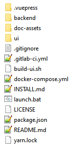

# 🇬🇧 Installation guide

This guide will help you install Conveyal Analysis using Docker.

**If you run into any problem, please [send us an email](mailto:johan.richer@jailbreak.paris?subject=Problem%20with%20conveyal-analysis-docker) or create a [new issue ticket](https://git.digitaltransport4africa.org/commons/conveyal-analysis-docker/issues/new).**

## Requirements

### Operating system

#### Windows

[Docker Desktop](https://www.docker.com/products/docker-desktop/) requires [Microsoft Windows 10 64-bit Pro, Enterprise, or Education](https://docs.docker.com/docker-for-windows/install/#system-requirements). ([Windows Home has specific instructions](https://docs.docker.com/docker-for-windows/install-windows-home/).)

#### macOS

[Docker Desktop](https://www.docker.com/products/docker-desktop/) requires [Apple macOS 10.14 or newer](https://docs.docker.com/docker-for-mac/install/#system-requirements).

#### Linux

[Docker Engine](https://docs.docker.com/engine/install/) is available on many other platforms such as [Ubuntu Linux](https://docs.docker.com/engine/install/ubuntu/).

### Browser

Conveyal Analysis is a tool which runs in your browser. We recommend that you use [Mozilla Firefox](https://www.mozilla.org/firefox/) or [Google Chrome](https://www.google.com/chrome/) for better usability.

## Windows

### Install Docker on your computer

1. [Click here](https://desktop.docker.com/win/stable/Docker%20Desktop%20Installer.exe) to download Docker Desktop for Windows.

2. Go to the Downloads folder and double-click `Docker Desktop Installer.exe` to run the installer.

3. Follow the install wizard to accept the license, authorize the installer, and proceed with the install until it is completed successfully. Windows should restart automatically if needed.

4. Open Docker Desktop for Windows via the Windows start menu:

5. The Docker whale logo must be present in the status bar:

Note: You need Docker Desktop to install and run Conveyal Analysis using the method explained in this guide. You can close Docker Desktop the rest of the time, or even uninstall it when you don't need it anymore.

### Install Conveyal Analysis

Note: Make sure Docker Desktop is up and running (see instructions above).

1. [Click here](https://git.digitaltransport4africa.org/commons/conveyal-analysis-docker/-/archive/master/conveyal-analysis-docker-master.zip) to download the files needed to install Conveyal Analysis.

2. Unzip the files in a folder where it's convenient, for example in your Documents folder.

3. Once it's unzipped, rename the folder to `conveyal-analysis-docker` or something convenient but without spaces in the name. All files should be contained directly within this folder:

4. Double-click on `launch.bat` and let the program do its thing. It will download and install Conveyal Analysis for the first time on your computer. This process will run in a terminal, which looks something like this:

It will take a little while but keep this window open.

In case of a Windows Security Alert about Docker, click "Allow access":

5. Once the installation is finished, [click here](http://localhost:3000/) to open Conveyal Analysis in your browser. It may take a while to load the first time, please be patient.

### Launch Conveyal Analysis

Ater Conveyal Analysis is installed, just double-click on `launch.bat` to start it again, and anytime you want. (It will be quicker this time since everything is already installed.)

After it's started, don't forget to open Conveyal Analysis in your browser by [clicking here](http://localhost:3000/)!

Note: Always make sure that Docker is running first (the whale logo in the status bar).

For ease of use, we recommend that you create a shortcut on your Windows desktop: right-click on `launch.bat` and click on Send to > Desktop. We also recommend that you bookmark Conveyal Analysis in your browser (http://localhost:3000/).

### Stop Conveyal Analysis

Closing the Conveyal Analysis tab in your browser or the terminal window won't actually stop the application, which will continue running in the background. This can unnecessarily use up your computer resources and we recommend that you stop Conveyal Analysis when you're not using it.

1. Open Docker Desktop.
2. Hover your mouse over `conveyal-analysis-docker`, you will see icons appear on the right.
3. Click once on the Stop icon ⏹️. The action will take a few moments to take effect, then `conveyal-analysis-docker` will appear as "Exited".

If you want to start Conveyal Analysis again, just use your shorcut or double-click on `launch.bat` as you did before.

### Configure the Mapbox Token

Conveyal Analysis uses a basemap to help you navigate the geography and interact with your projects. This basemap is provided by Mapbox and works only if you have a valid token. By default, we configured a demo token from Mapbox to enable you to try Conveyal Analysis. We can't guarantee this token to be active forever which means that the basemap might stop working at any time. If you want to fix this and durably use Conveyal Analysis, you should configure your own Mapbox Token. Here's how you do it:

First you need to obtain a personal public Mapbox token:

1. [Create a free Mapbox account](https://account.mapbox.com/auth/signup/) if you don't have one.
2. Sign in to your Mapbox account and go to the [Tokens page](https://account.mapbox.com/access-tokens/). There should be a "Default public token": a long string of random characters starting with `pk.`
 (If you don't have one, [create a new token](https://account.mapbox.com/access-tokens/create) with default settings.)
3. Copy the token by simply clicking the 📋 icon.

Then, you add your personal key to the configuration:
1. Go to the `conveyal-analysis-docker` folder on your computer (the one you unzipped before, it should be in your Documents folder).
2. Open the `ui` folder.
3. Open the `.env` file: right-click on it, select "Open with" and in the list of programs choose a text editor such as Notepad.
4. On the last line of the text file replace the text after `NEXT_PUBLIC_MAPBOX_ACCESS_TOKEN=` by your own token, which you copied before.

Finally, you need to rebuild Conveyal Analysis (actually just its user interface) so that the basemap takes into account the new token:
1. Go back to the `conveyal-analysis-docker` root folder.
2. Double-click on `rebuild-ui.bat`. A new terminal window will open, which looks something like this:

The process will take a little while, keep the window open to make sure it succeeds. When its finished, the terminal window will close itself.

Now you can go back to `launch.bat`, using Conveyal Analysis normally and for as long as you want. Enjoy!

### Learn how to use Conveyal Analysis

[We recommend you read the official manual.](https://docs.analysis.conveyal.com/)

### Go further

If running Conveyal Analysis on your machine does not provide a satisfying experience, we recommend you use the [Conveyal cloud services](https://www.conveyal.com/analysis) which are more suited for advanced uses and will be personalized to your needs.